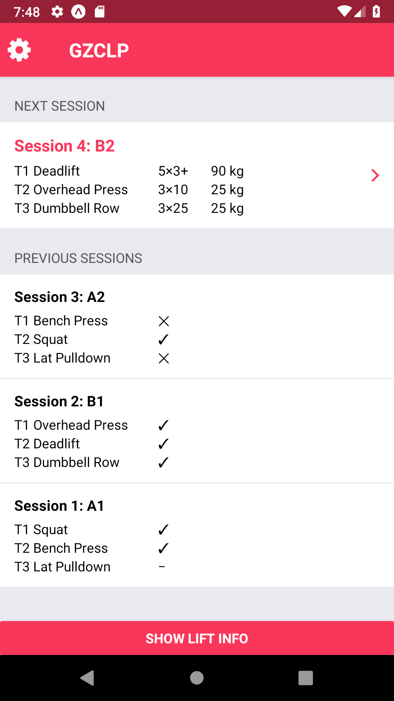
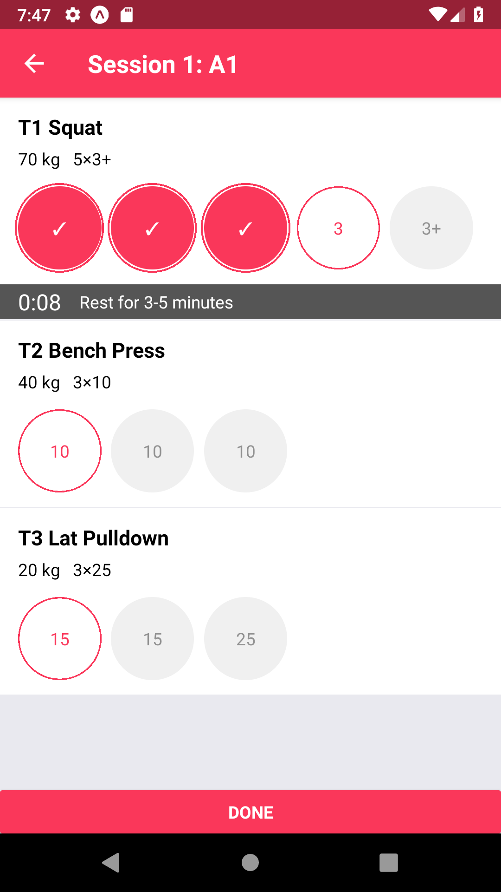
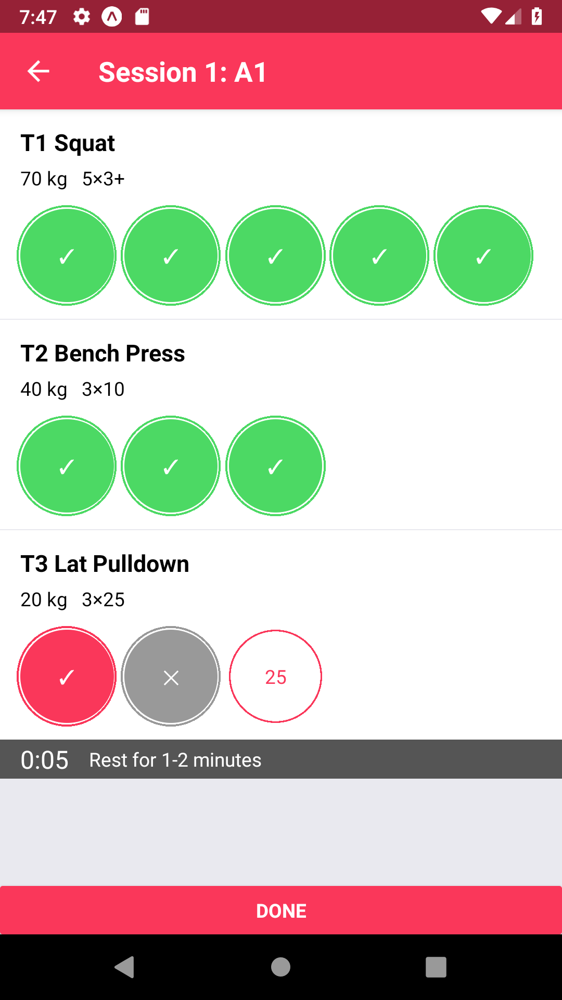

# GZCLP App

GZCLP is the name for [Cody LeFever’s linear-progression strength training program for beginners](https://saynotobroscience.com/gzclp-infographic/), and this app for iOS and Android makes following it easy.

It tells you exactly what, when and how much to lift, tracks your progress, and tells you what you'll be lifting next time.

[**Web-based demo**](https://gzclp.expo.app) (the routing in this is a little buggy)

  
   
  

### Development Notes

Written in JavaScript using [React Native](https://facebook.github.io/react-native/), and tested and compiled using [Expo CLI and Client](https://expo.io/tools).

Basic functionality complete. Following functionality to be implemented in later versions:
* Graphs that display progress over time for each lift
* Easier editing and reorganising of workouts (for example allow lifts to be reordered by dragging and dropping)
* Allow user to export/back-up all workout data
* Phone notifications to prompt user when their rest time is up
